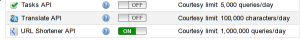
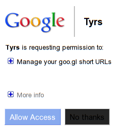

.. _googl:

Api goo.gl et OAuth
===================

Désirant essayer un peu le service de Google pour raccourcir les URL goo.gl, j'ai
voulu l'intégrer à mon petit client Twitter `Tyrs`_ [1]_, et surtout intégrer
l'identification Oauth. Nous allons voir ici comment utiliser l'API pour
raccourcir un lien, et la documentation pour aller plus loin.

Pas de débats sur Google, mais simplement une bonne occasion d'essayer un
nouveau jouet et de se plonger un peu dans du code.

Enregistrer son application
---------------------------

Comme toujours avec Oauth, il faut dans un premier temps enregistrer votre
application, `en allant sur le lien suivant`_ [2]_, comme l'est expliqué `ici`_ [3]_.
Vous remplissez les quelques cases, attention, il faut choisir ici *Installed
application*, correspondant à un usage Desktop, et non un service sur un site
web. Vous devez également activer le support pour l'urlshortener,
comme le montre l'image suivante, disponible toujours au même endroit :

.. note::

    **Pour suivre ce tutoriel, vous n'êtes pas obligé d'enregistrer une
    application.** Si vous le faite, vous avez obtenu un classique couple de clef
    client id / client secret. Un client secret, qui comme je l'expliquais dans le
    chapitre précédent, n'a rien de secret du tout, et peut être partagé par
    tous.  L'exemple sera pris avec les clés préparées et fonctionnant, vous
    pouvez donc les utiliser.

Les dépendances
---------------

Une seule dépendance est requise, mais une autre est optionnelle, on verra par la
suite pourquoi.

- **google-api-python-client**

Cette bibliothèque est disponible à plusieurs endroits, dont `le dépôt
officiel`_ [5]_ et sur `pypi`_ [6]_, service connu des pythonistes.

Il peut être utile de regarder dans les dépôts de votre distribution avant,
pour Arch Linux, j'ai regardé, et il est disponible avec un::

    yaourt -S python2-google-api-python-client

- **python-gflags**

Pas utile si vous suivez _strictement_ le tuto, mais si vous prenez l'autre
code exemple que je vais fournir en lien, vous en aurez besoin. `La page du
projet`_ [7]_, et très certainement disponible sur pypi également.

Pour Arch Linux::

    yaourt -S python-gflags

Le code
-------

Le code suivant, est une version simplifiée du code exemple pouvant être trouvé
sur `le lien suivant`_ [8]_, on peut noter qu'on trouve également des exemples pour
d'autres langages tel que Ruby, Java, PHP, .NET…

La version que je fournis plus bas, reposant sur leur exemple  est allégée du
système de logging et de leur système de commande, qui nécessite également la
dépendance *python-gflags* qui n'apporte pas un plus ici (surtout que leur lien
à raccourcir est écrit en dure dans le code)

L'usage voulu ici est par exemple ``./googl.py http://www.nicosphere.net``, et
ainsi obtenir en retour le lien raccourci.

::

    import httplib2
    import sys

    from apiclient.discovery import build
    from oauth2client.file import Storage
    from oauth2client.client import AccessTokenRefreshError
    from oauth2client.client import OAuth2WebServerFlow
    from oauth2client.tools import run

    FLOW = OAuth2WebServerFlow(
        client_id='382344260739.apps.googleusercontent.com',
        client_secret='fJwAFxKWyW4rBmzzm6V3TVsZ',
        scope='https://www.googleapis.com/auth/urlshortener',
        user_agent='urlshortener-tyrs/1.0')

    def main(argv):

      # On essaie d'obtenir le lien fourni en ligne de commande
      try:
        long_url = argv[1]
      except IndexError:
        print 'Il faut fournir une URL'
        return

      # Une fonctionnalité de l'API est associée au fichier googl.tok
      storage = Storage('googl.tok')
      credentials = storage.get()
      # Si le fichier n'existe pas, ou n'est pas valide, on demande une
      # autorisation, le fonctionnement est directement dans l'API de Google.
      if credentials is None or credentials.invalid:
        credentials = run(FLOW, storage)

      # La requête http est préparée.
      http = httplib2.Http()
      http = credentials.authorize(http)
      service = build("urlshortener", "v1", http=http)

      try:

        url = service.url()

        body = {"longUrl": long_url }
        # On envoie le tout
        resp = url.insert(body=body).execute()

        short_url = resp['id']
        # On imprime le résultat
        print short_url

      except AccessTokenRefreshError:
        print ("The credentials have been revoked or expired, please re-run"
          "the application to re-authorize")

    if __name__ == '__main__':
      main(sys.argv)

.. warning::

    Python 2.x est utilisé ici, et ne fonctionnera pas avec Python3

Authentification à votre compte
-------------------------------

À la première utilisation, Il vous sera demandé de suivre un lien, afin
d'autoriser l'application à s'associer avec votre compte, vous devez être
identifié à votre compte Google. Exactement comme lorsque vous utilisez un
nouveau client Twitter avec un compte, sauf que ici, pas besoin de PIN code de
validation.

Pour que l'application soit utilisable une fois sur l'autre sans avoir à
valider, les accès sont enregistré dans un fichier, à côté de votre exécutable,
dans cet exemple : `googl.tok`

La sortie console ressemble à cela ::

    $ python2.7 googl.py http://www.nicosphere.net
    Go to the following link in your browser:
    https://accounts.google.com/o/oauth2/auth?scope=https%3A%2F%2Fwww.googleapis.com%2Fauth%2Furlshortener&redirect_uri=http%3A%2F%2Flocalhost%OPo0%2F&response_type=code&client_id=4242424242424.apps.googleusercontent.com

    You have successfully authenticated.

Du côté validation dans le navigateur web, cela ressemble à ça :

.. note::

    Les clefs sont celles générées pour `Tyrs`_ [1]_, c'est pourquoi il apparaît
    dans le capture d'écran, si vous avez suivis la première étape, vous devez avoir
    le nom de votre application apparaître.

Finalement, vous devez voir dans la console le lien raccourcis correspondant,
si l'opération est renouvelée il n'y a pas besoin de s'authentifier comme la
première fois.

Conclusion
----------

Ici on ne fait que retourner le lien raccourci de Google, l'API permet d'en
faire bien plus encore, pour cela, il faut consulter `le guide de
démarrage`_ [10]_ ou `la référence de l'API`_ [9]_. Mais ce petit morceau de code
permet d'avoir une idée, et montre que l'utilisation Oauth / API Google est
plus accessible qu'on pourrait le croire au premier abord.

.. _`Tyrs`: http://tyrs.nicosphere.net
.. _`en allant sur le lien suivant`: https://code.google.com/apis/console/
.. _`ici`: http://code.google.com/apis/accounts/docs/OAuth2.html#Registering
.. _`le dépôt officiel`: http://code.google.com/p/google-api-python-client/
.. _`pypi`: http://pypi.python.org/pypi/google-api-python-client/1.0beta2
.. _`La page du projet`: http://code.google.com/p/python-gflags/
.. _`le lien suivant`: http://code.google.com/p/google-api-python-client/source/browse/samples/urlshortener/urlshortener.py
.. _`la référence de l'API`: http://code.google.com/apis/urlshortener/v1/reference.html
.. _`le guide de démarrage`: http://code.google.com/apis/urlshortener/v1/getting_started.html

.. [1] http://tyrs.nicosphere.net Tyrs est un client Twitter en console utilisant
    ncurses et sous licence GPL. J'en ai commencé l'écriture début mai
    (2011), il est fonctionnel et je m'en sers encore au quotidien.
.. [2] https://code.google.com/apis/console/
.. [3] http://code.google.com/apis/accounts/docs/OAuth2.html#Registering
.. [5] http://code.google.com/p/google-api-python-client/
.. [6] http://pypi.python.org/pypi/google-api-python-client/1.0beta2
.. [7] http://code.google.com/p/python-gflags/
.. [8] http://code.google.com/p/google-api-python-client/source/browse/samples/urlshortener/urlshortener.py
.. [9] http://code.google.com/apis/urlshortener/v1/reference.html
.. [10] http://code.google.com/apis/urlshortener/v1/getting_started.html

