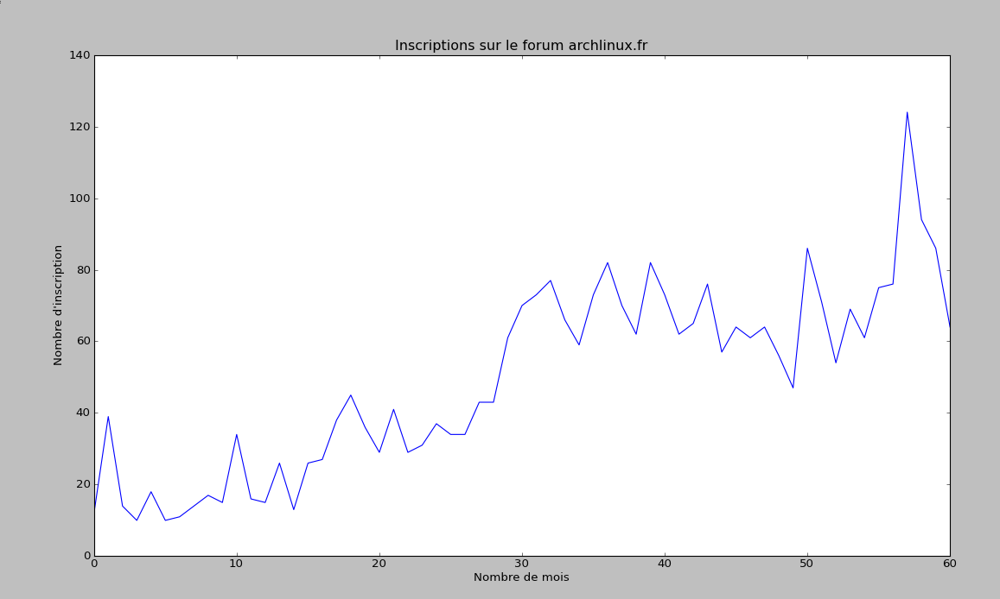
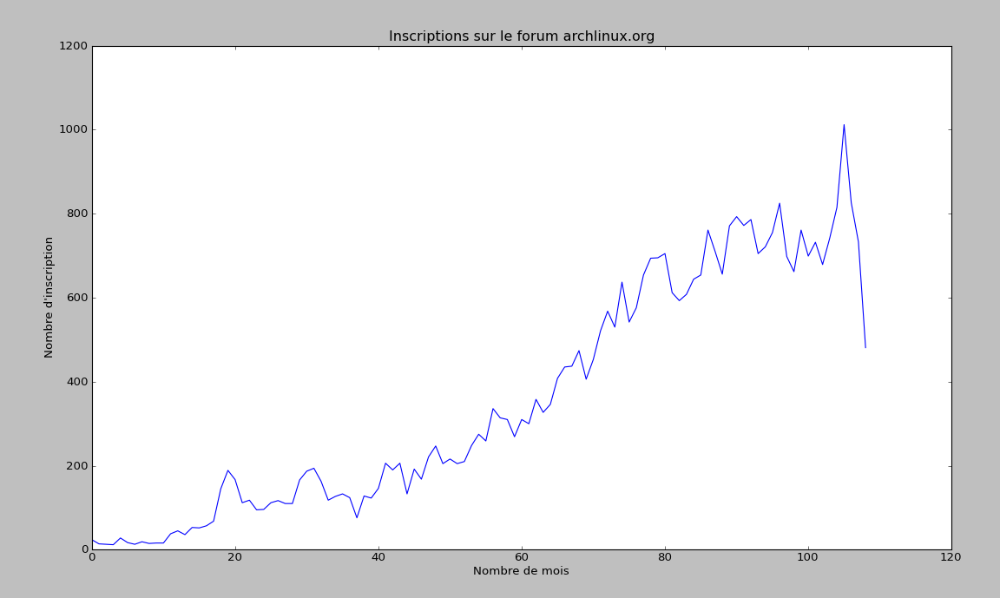

.. _scrapy-web:

Scrapy, Crawler web
===================

Les forums (oui, je n'utiliserai pas fora), sont un bon moyen de visualiser
l'état de santé d'une communauté. Si on me présente un projet comme
révolutionnaire et incontournable, et que le forum contient trois sujets et
deux membres, j'aurais comme des doutes.

Dans le cas d'archlinux.fr, il pourrait être intéressant de visualiser le
nombre d'inscriptions en fonction du temps, d'en visualiser une tendance
générale.  Et en prime, comparer les résultats avec le forum anglophone
d'archlinux.org. C'est exactement ce qui va être fait dans ce billet.

Les forums fournissent généralement une liste de membre, avec la date
d'inscription, le plus souvent accessible uniquement aux membres déjà inscrit
(et ça tombe bien, ça rend le jeu plus intéressant). L'idée est simplement de
récupérer toutes les dates d'inscriptions, d'en faire un cumule pour chaque
mois, et de faire un petit graphique pour présenter et visualiser le résultat.
Évidemment, comme c'est un blog aussi sur la programmation, on va voir comment
obtenir ce graphique ici.

J'avoue, le but était bien plus d'essayer de nouveaux jouets, et de programmer
un peu, que de vraiment connaître le résultat qui ne sont pas à prendre au pied
de la lettre, d'autres solutions certainement plus simple existe, mais je
voulais vraiment essayer `Scrapy`_ dans un exemple réel. Scrapy semble être un
outil vraiment puissant et modulable, il est évident que l'utiliser ici pour
résoudre ce problème si simple est une solution démesurée. Cependant,
je pense que pour découvrir un outil, il est préférable de l'essayer avec un
problème simple. C'est pourquoi je l'emploie ici.

Prérequis
---------

Ce billet s’appuie sur `Scrapy`_ pour crawler le forum et `Pylab`_ pour
obtenir le graphique, pylab est fourni par matplotlib. Il convient de
l'installer avant avec ``pip``, ``easy_install`` ou des gestionnaires de paquets
comme ``pacman`` et ``apt-get``. Dans le cas d'archlinux.org, il n'est accessible
uniquement par du https, il convient d'installer pyopenssl

Arch Linux et Yaourt
''''''''''''''''''''

::

    yaourt -S scrapy python2-matplotlib pyopenssl

Pip
'''

::

    sudo pip install matplotlib scrapy pyopenssl

Scrapy, récupérer les données
-----------------------------

La première chose à faire est de créer un nouveau projet, scrapy vient avec une
suite de commande shell, dont startproject nous facilite la mise en place de
notre nouveau projet.

Génération du projet
''''''''''''''''''''

::

    scrapy startproject archlinux

::

    $ tree archlinux
    archlinux
    |── archlinux
    │   |── __init__.py
    │   |── items.py
    │   |── pipelines.py
    │   |── settings.py
    │    ── spiders
    │        ── __init__.py
     ── scrapy.cfg

    2 directories, 6 files

La structure peut dérouter au début, mais elle est logique est sa prise
en main rapide. En gros, on va créer un *spider* dans le répertoire, qui
récupèrera les données, et suivra les urls qu'on lui indiquera, il se chargera
de s'identifier au début sur le forum, chaque donnée, ou élément sera défini
dans items.py, et traite dans pipelines, dans ce cas afin de les sauvegarder.

Les items
'''''''''

Commençons par le plus simple, définir les *items*, qui sera tout seul en fait
dans ce cas, seul la date nous intéresse.

`archlinux/items.py`::

    from scrapy.item import Item, Field

    class ArchlinuxItem(Item):
        date = Field()

Comme le générateur de projet fournis un squelette bien avancé déjà, il n'est
utile que de rajouter la ligne `date = Field()` permettant de définir
l'item date.

Le spider
'''''''''

Cette partie est la plus compliquée, je vais essayer de l'expliquer au mieux.
Dans le fichier ``archlinux/spiders/archlinux_spider.py``.
On commence par les imports.

::

    from scrapy.spider import BaseSpider
    from archlinux.items import ArchlinuxItem
    from scrapy.http import FormRequest, Request
    from scrapy.selector import HtmlXPathSelector
    from scrapy.contrib.linkextractors.sgml import SgmlLinkExtractor

Puis on va créer une classe héritant d'un spider de base, dans l'exemple,
on prends en compte le forum d'archlinux.fr.

À propos de l'extracteur de lien ``extractor``, C'est l'initialisation de ce
qui extrait les liens à suivre, d'une part on le restreint à ``memberlist``, mais
l'idée est de toujours suivre le lien "suivant" un peu comme on cliquerai pour
aller du début à la fin de la liste de membre, en appuyant frénétiquement sur
Suivant.  Le suivant est trouvé en restreignant au bon lien avec Xpath.

::

    class ArchLinuxSpider(BaseSpider):

        name = "archlinux"
        allowed_domains = ["forums.archlinux.fr"]
        extractor = SgmlLinkExtractor(allow='memberlist',
                                  restrict_xpaths='//a[. = "Suivant"]')

``start_requests`` est la première fonction appelée après l'initialisation
du bot, je m'en sers ici pour demander une page d'identification, afin de la
remplir avec mes identifiants, cette façon de procéder permet de
m'assurer que les champs caché (token, csrf...) sont correctement
remplis, ou encore de gérer les sessions, cookies...
On retourne un Request, avec comme callback la fonction qui gèrera le
login.

::

    def start_requests(self):
        login_url ='http://forums.archlinux.fr/ucp.php?mode=login'
        return [Request(login_url, callback=self.login)]

La page de login est reçue, on traite ici en utilisant une classe un peu
spéciale ``FormRequest`` et surtout avec la méthode ``from_response``. On
renseigne les éléments, et la réponse de cette demande de login sera
géré par la méthode ``after_login (callback)``.

::

    def login(self, response):
        return [FormRequest.from_response(response,
                        formdata={'username': 'Nic0',
                                  'password': 'correcthorsebatterystaple'},
                        callback=self.after_login)]

En dernier, on gère les pages normalement, avec `parse` qui est la fonction par
défaut pour faire le traitement des pages.  On y gère la réponse, c'est-à-dire
la page html téléchargée, et on en extrait les liens à suivre, qui seront rajoutés
dans la queue avec ``yield Request``, la fonction de rappel se fera dans cette fonction.

À propos de ``HtmlXPathSelector``, on cherche à trouver tous les éléments
contenant la date, ils sont extrait en regardant le code source d'une page html
et en adaptent l'Xpath encore une fois. Chaque élément trouvé est rajouté avec
``yield item``, qui est en relation avec l'élément du fichier défini plus haut.

::

    def parse(self, response):
        links = self.extractor.extract_links(response)
        for url in links:
            yield Request(url.url, callback=self.parse)
        hxs = HtmlXPathSelector(response)
        dates = hxs.select('//td[contains(@class, "genmed")]/text()').extract()
        for date in dates:
            item = ArchlinuxItem()
            item['date'] = date
            yield item

Le Pipeline
'''''''''''

Dans cet exemple, on va simplement rajouter chaque élément dans un fichier,
et le traîter par un petit script python plus tard, il serait faisable de le
faire en même temps ici.

`archlinux/pipelines.py`::

    class ArchlinuxPipeline(object):

        def __init__(self):
            self.file = open('result.txt', 'wb')

        def spider_closed(self, spider):
            self.file.close()

        def process_item(self, item, spider):
            item['date'] = item['date'][1:-1].split(',')[0]
            item['date'] = item['date']
            self.file.write(item['date'].encode('utf-8')+'\n')
            return item

Ce fichier à moins besoin d'explication, il s'assure surtout de ne stocker que
la date, dans un format correct.

Pour que ce fichier soit pris en compte, il faut le rajouter dans la
configuration, c'est la dernière ligne qui nous intéresse ici :

`archlinux/settings.py`::

    BOT_NAME = 'archlinux'
    BOT_VERSION = '1.0'

    SPIDER_MODULES = ['archlinux.spiders']
    NEWSPIDER_MODULE = 'archlinux.spiders'
    DEFAULT_ITEM_CLASS = 'archlinux.items.ArchlinuxItem'
    USER_AGENT = '%s/%s' % (BOT_NAME, BOT_VERSION)
    ITEM_PIPELINES = ['archlinux.pipelines.ArchlinuxPipeline']

Mise en route
'''''''''''''

La mise en fonctionnement du bot est très simple et se fait en ligne de
commande. Une longue suite de ligne de débug apparaîtra en console, mais le
plus important est de vérifier le résultat obtenu. Et après avoir analysé une
trentaine de pages, on obtient le fichier ``result.txt`` voulu.

::

    $ scrapy crawl archlinux

Le résultat semble correct, et surtout::

    $ cat result.txt | wc -l
    3017

Un rapide coup d'œil au forum, qui indique le nombre d'inscrits, je tombe
exactement sur le même chiffre, ce qui est rassurant. Nous voilà avec un grand
fichier, avec tout plein de dates. Il nous faut maintenant trouver le moyen de
traiter ces informations.

Traitement des données
----------------------

Les dates sont sous la forme *jour mois année*, on souhaite cumuler le nombre
de *mois année* identique, et l'afficher sous forme de graphique. Le script
suivant répond à ce besoin.

::

    import pylab

    with open('result.txt', 'r') as f:
        dates = []
        values = []
        for line in f:
            line = line.strip().split(' ')[2:]
            line = ' '.join(line)
            try:
                if dates[-1] == line:
                    values[-1] += 1
                else:
                    dates.append(line)
                    values.append(1)
            except IndexError:
                dates.append(line)
                values.append(1)

    pylab.title('Inscriptions sur le forum archlinux.fr')
    pylab.xlabel('Nombre de mois')
    pylab.ylabel('Nombre d\'inscription')
    pylab.plot(values)
    pylab.show()

Le script fait ce qu'on demande, mais en y repensant, il y avait plus simple et
plus élégant comme méthode, l'idée est de comparer la date avec le dernière
élément et d'incrémenter ou de le rajouter selon le cas. Comme il existe une
méthode permettant d'avoir le nombre d’occurrence d'un tableau, il aurait été
préférable que je m'arrange de n'avoir que le *mois année* dans mon table et de
traiter les occurences. Mais bon… Pylab gère également les abscisses avec les
dates, je n'ai pas vu en détail ce fonctionnement bien qu'il aurait été
pertinent de le faire.

Résultat
--------

Il est temps de lancer le script, et de regarder les résultats obtenu, notons
que le mois d'Août n'étant pas fini (au moment de la réduction du billet), il
est normal de se retrouver avec une baisse pour le dernier mois.

Arch Linux Francophone
----------------------

Arch Linux Anglophone
---------------------

Le principe est le même, il faut simplement adapter certains détails pour le
forum anglophone, qui n'utilise plus phpbb mais fluxbb, je place les codes ici,
sans plus d'explications.

Il faut tout de même parser 760 pages pour obtenir les 34 000 membres. Bien
sûr, on retrouve dans notre fichier le nombre exact de membres.

Tout de fois, un petit traitement du fichier en ligne de commande a été utile,
d'une part avec vim (ou sed) car les inscriptions du jour et d'hier sont notées
Yesterday et Today, au lieu de la date, ça pourrait fausser le résultat.
D'autre part, pour que les dates soient dans l'ordre, un ``sort`` est requis.
Si vraiment on y tient, il aurait été facile de le placer directement dans le
script après.

`archlinux/archlinux_spider.py`::

    from scrapy.spider import BaseSpider
    from archlinux.items import ArchlinuxItem
    from scrapy.http import FormRequest, Request
    from scrapy.selector import HtmlXPathSelector
    from scrapy.contrib.linkextractors.sgml import SgmlLinkExtractor

    class ArchLinuxSpider(BaseSpider):

        name = "archlinux"
        allowed_domains = ["bbs.archlinux.org"]
        extractor = SgmlLinkExtractor(allow='userlist',
                                      restrict_xpaths='//a[. = "Next"]')

        def parse(self, response):
            links = self.extractor.extract_links(response)
            for url in links:
                yield Request(url.url, callback=self.parse)

            hxs = HtmlXPathSelector(response)
            dates = hxs.select('//td[contains(@class, "tcr")]/text()').extract()
            for date in dates:
                item = ArchlinuxItem()
                item['date'] = date
                yield item

        def start_requests(self):
            login_url ='https://bbs.archlinux.org/login.php'
            return [Request(login_url, callback=self.login)]

        def login(self, response):
            return [FormRequest.from_response(response,
                            formdata={'req_username': 'Nic0', 'req_password': 'my_password'},
                            callback=self.after_login)]

        def after_login(self, response):
            memberlist_url = 'https://bbs.archlinux.org/userlist.php'
            yield Request(memberlist_url, callback=self.parse)

Et maintenant le fichier `archlinux/pipelines.py`::

    class ArchlinuxPipeline(object):

        def __init__(self):
            self.file = open('result.txt', 'wb')

        def spider_closed(self, spider):
            self.file.close()

        def process_item(self, item, spider):
            item['date'] = item['date'][:-3]
            self.file.write(item['date'].encode('utf-8')+'\n')
            return item

Et le script gérant pylab::

    import pylab

    with open('result.txt', 'r') as f:
        dates = []
        values = []
        for line in f:
            line = line.strip()
            try:
                if dates[-1] == line:
                    values[-1] += 1
                else:
                    dates.append(line)
                    values.append(1)
            except IndexError:
                dates.append(line)
                values.append(1)

    pylab.title('Inscriptions sur le forum archlinux.org')
    pylab.xlabel('Nombre de mois')
    pylab.ylabel('Nombre d\'inscription')
    pylab.plot(values)
    pylab.show()

Et le résultat en image:

Conclusion
----------

Beaucoup de code pour pas grand chose pourrait on dire, cependant cela m'a été
instructif sur bien des points.

Même si le titre du billet (originalement publié sous le titre *Petit bilan de
santé d'Arch Linux*) n'est pas à prendre au pied de la lettre, ces deux
graphiques donnent tout de même une petite indication sur l'état de santé des
deux communautés d'Arch Linux. Chacun trouvera les interprétations à faire à
partir des graphiques. Pour ma part, en conclusion, je dirai simplement :

Arch Linux se porte plutôt bien, et votre forum favori ?

.. _`Scrapy`: http://scrapy.org/
.. _`Pylab`: http://matplotlib.sourceforge.net/

.. [1] http://scrapy.org/
.. [2] http://matplotlib.sourceforge.net/
