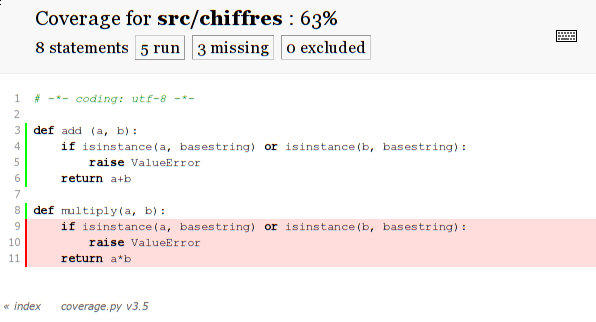

.. _coverage:

Couverture de code
==================

Nous allons voir cette fois ci une façon de visualiser, par console ou html, la
quantité de code que couvre les tests.  Lorsque le code et le nombre de tests
correspondant grossi, il est utile de trouver un moyen d'en faire un bilan, il
existe pour cela `la couverture de code`_ [1]_, sûrement plus connu sous son nom
anglais de **code coverage**. C'est ce que l'on va regarder dans ce billet, à
l'aide de Nose et de Coverage.

Installation
------------

Si vous n'avez pas déjà installé Nose, faite le comme suit, ou consultez le
chapitre sur nose  pour plus de détails.

::

    sudo pip install nose

Pour installer coverage, la procédure est similaire, on peut déjà noté que
coverage n'est utilisé uniquement ici pour générer l'html.

::

    sudo pip install coverage

Les utilisateurs d'Arch Linux pourront le retrouvé avec l'AUR

::

    3 aur/python-coverage 3.4-1 (Out of Date) (36)
        A tool for measuring code coverage of Python programs.

On note que le paquet est marqué périmé, cependant la version 3.5 n'est sortie
que depuis un mois, et cette version doit certainement faire l'affaire.

Usage console
-------------

Reprenons l'exemple précédant, une fonction add, auquel on rajoute une fonction
multiply, mais sans lui rajouter de tests. La première fonction est testé de
diverses façons (doctest, unittest, framework test de nose), alors que la seconde n'en comporte aucun.

Le fichier ``src/chiffres.py`` ressemble maintenant à ça::

    def add (a, b):
        if isinstance(a, basestring) or isinstance(b, basestring):
            raise ValueError
        return a+b

    def multiply(a, b):
        if isinstance(a, basestring) or isinstance(b, basestring):
            raise ValueError
        return a*b

On utilise l'argument ``--with-coverage`` de Nose, ou tout simplement rajouter
``with-coverage=1`` dans le ``~/.noserc``.

On effectue les tests précédemment écrit, attention à basestring qui n'existe
que pour Python2.x mais plus dans Python3::

    $ nosetests-2.7 --with-coverage
    test_add_string (test_chiffres.TestChiffres) ... ok
    [.....]
    test_spec_chiffres.test_should_raise_an_exception_with_two_string ... ok

    Name       Stmts   Miss  Cover   Missing
    ----------------------------------------
    chiffres       8      3    63%   9-11
    ----------------------------------------------------------------------
    Ran 10 tests in 0.046s

    OK

L'important est de remarquer le pourcentage, mais également le `9-11`
correspondant au lignes pour lequel il ne comporte pas de tests. L'exemple
étant petit, on pouvait retrouver le résultat de tête facilement.

Une alternative est d'utiliser directement coverage comme suit::

    $ coverage report
    Name                       Stmts   Miss  Cover
    ----------------------------------------------
    src/chiffres                   8      3    63%
    tests/test_chiffres           13      1    92%
    tests/test_nose_chiffres       8      0   100%
    tests/test_spec_chiffres       8      0   100%
    ----------------------------------------------
    TOTAL                         37      4    89%

Il manque cependant l'indication sur les lignes manquantes, sauf si je l'ai
raté, mais il n'est peut être pas utile de toujours l'avoir.

Sortie HTML
-----------

Nose vient avec un argument ``--cover-html``, cependant il est inutile de perdre
du temps à essayer de le faire fonctionner, il comporte un bug depuis quelques
années, le développeur le sait, et il est probable que cela reste comme ça
encore longtemps, l'auteur encourage l'utilisation de `coverage` qui produit de
toute façon un meilleur html (selon ses dires).

Utiliser ``nosetests --with-coverage`` avant coverage lui sert de hook.

    $ nosetests-2.7 --with-coverage
    [...]
    $ coverage html

Le résultat se trouvera dans le répertoire `htmlcov/` pour lequel il suffit par
exemple de faire::

    $ firefox htmlcov/index.html

On obtiendra un résultat similaire à l'image suivante :

Un exemple plus réel et navigable est visitable sur `ce lien`_ [3]_.

Voilà pour une présentation rapide d'une utilisation un peu spécifique de Nose,
mais pouvant être utile. 

.. _`la couverture de code`: http://fr.wikipedia.org/wiki/Couverture_de_code
.. _`ce lien`: http://nedbatchelder.com/code/coverage/sample_html/

.. [1] http://fr.wikipedia.org/wiki/Couverture_de_code
.. [3] http://nedbatchelder.com/code/coverage/sample_html/
