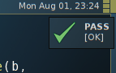
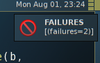

.. _watchr-ch:

Autotest avec Watchr
====================

Introduction
------------

`Watchr`_ [1]_est un petit utilitaire pouvant être très pratique, il permet
d'automatiser des tests à la sauvegarde de fichier. Bien qu'il soit écrit en
Ruby, il peut être utilisé avec n'importe quel langage, je m'en suis servis par
exemple pour Symfony2 (avec PHPUnit), mais plus récemment avec Python. Voici
une liste d'avantage qu'on peut trouver à ce genre d'outil :

* Entièrement scriptable
* Fonctionne avec des regex
* Indépendant de tout langages ou frameworks (PHPunit, unittest, nosetests...)
* Possibilité d'utiliser la notification du système d'exploitation
* Réutilisable d'un projet à l'autre
* Met à disposition toutes les richesses de Ruby

Installation
------------

L'installation se fait simplement avec rubygem, ou directement avec le dépôt
git. Comme l'utilisation de rubygem est plus propre, voici comment, en root :

::

    gem install watchr

Mode de fonctionnement
----------------------

L'idée, et de faire correspondre à des fichiers "surveillés" une suite de
commande, que l'on aura scripté dans un fichier de configuration au préalable.
Ces règles vont être écrites dans un fichier appelé watchrc.rb, et la syntaxe
est celle du Ruby comme on peut le deviner. Le nom du fichier est arbitraire et
passé en argument.

Python et la syntaxe
--------------------

Un premier exemple permet de vérifier la syntaxe du fichier à chaque sauvegarde
dans une console séparé. Certes des plugins de Vim on une approche similaire
pour la syntaxe de Python, mais comme on le vera, watchr offre d'autres
possibilités.

`watchrc.rb`::

    watch '^src/(.*)\.py$' do |match|
        pychecker match[0]
    end

    def pychecker file
      system("pychecker --stdlib #{file}") if File.exists?(file)
    end

On lance l'application::

    watchr watchrc.rb

Puis on commence à éditer un fichier Python dans le répertoire 'src'. Alors
qu'une fois l'application lancé, rien ne s'affichait, et semblait attendre, dès
lors qu'on sauvegarde le fichier, la vérification syntaxique se fait
automatiquement, avec la sortie en console.

Python et les tests
-------------------

On va automatiser les tests à la sauvegarde de fichier, en surveillant d'une
part le répertoire `src` et `tests`. Dans un premier temps, on va au plus
simple, c'est à dire que si l'un est déclenché, on lance la totalité des tests.
Cependant, dans un cas où le projet est plus gros, on ne souhaite pas forcément
lancer tout les tests, mais seulement ceux correspondant au fichier édité. Mais
chaque exemple en son temps.

`watchrc.rb`::

    watch '^src/(.*)\.py$' do |match|
        unittest
    end

    watch '^tests/(.*)\.py$' do |match|
        unittest
    end

    def unittest
      system("nosetests")
    end

Pour s'assurer que ça fonctionne, on démarre watchr comme vu précédemment, et
on édite un des fichiers surveillé, si tout ce passe bien, le tests devrait
s’enclencher automatiquement après la sauvegarde.

::

    watchr watchrc.rb

Python et un test
-----------------

Comme dit plus haut, si la suite de tests prend trop de temps à s'exécuter, il
est préférable de ne sélectionner qu'un seul à effectuer. Pour faire cela, ça
dépends des conventions utilisés par chacun, pour ma part, je fais toujours
correspondre :

* src/mon_fichier.py
* tests/test_mon_fichier.py

L'astuce sera donc de passer en argument le fichier de tests a exécuter, si le
fichier édité est le fichier source, une substitution de la chaine sera
requise, si le fichier édité est le fichier de test, on peut l'exécuter tel
quel.

`watchrc.rb`::

    watch '^src/(.*)\.py$' do |match|
        unittest match[0].sub('src/', 'tests/test_')
    end

    watch '^tests/(.*)\.py$' do |match|
        unittest match[0]
    end

    def unittest file
        system("nosetests #{file}") if File.exists? (file)
    end

Le résultat attendu est obtenu, en console.

Notification système
--------------------

Maintenant que le script fonctionne, rajoutons une notification, afin de ne pas
avoir besoin de garder la console sur le bureau courent, tout en aillant une
indication. La notification est simple, indiquant si le test passe ou non, en
rajoutant une petite icon ('ok vert', 'pas bon rouge') afin de garder un
reperd visuel, pour un gain de confort et de temps.

`watchrc.rb`::

    watch '^src/(.*)\.py$' do |match|
        unittest match[0].sub('src/', 'tests/test_')
    end

    watch '^tests/(.*)\.py$' do |match|
        unittest match[0]
    end

    def unittest file
        cmd = "nosetests-2.7 #{file} 2>&1"
        out = `#{cmd}`
        puts(out)
        notify out
    end

    def notify (message)
        result = message.split(' ').last(1)
        title = result.find { |e| /failures/ =~ e } ? "FAILURES" : "PASS"
        if title == "PASS"
            icon = "~/ok.png"
        else
            icon = "~/fail.png"
        end
        system ("notify-send -i #{icon} #{title} #{result}")
    end

Et le résultat en image :

Pour les autres langages
------------------------

Il est évident que ce code peut être adapté à tout framework de test unitaire
ou de test de syntaxe, correspondant au divers langages, comme par exemple PHP
avec phpunit. Il suffit d'adapter la commande et les structures de répertoires selon le besoin.

À titre informatif, je mets un exemple d'une personne aillant rédigé pour du
php `un billet`_ [2]_(en), et `une configuration`_ [3]_ assez complète pour Rails.

Conclusion
----------

Watchr est un utilitaire bien pratique et surtout malléable, toujours bon à
connaître.

.. _`Watchr`: https://github.com/mynyml/watchr
.. _`un billet`: http://criticallog.thornet.net/2011/03/08/autotesting-with-watchr-growl-and-phpunit/
.. _`une configuration`: https://raw.github.com/gist/276317/45b7ca8a20f0585acc46bc75fade09a260155a61/tests.watchr 

.. [1] https://github.com/mynyml/watchr
.. [2] http://criticallog.thornet.net/2011/03/08/autotesting-with-watchr-growl-and-phpunit/
.. [3] https://raw.github.com/gist/276317/45b7ca8a20f0585acc46bc75fade09a260155a61/tests.watchr
